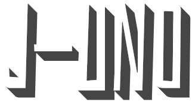

# Introduction

J-Uno is a video game based on [Uno](https://en.wikipedia.org/wiki/Uno_card_game) cards.
#

# About the game

Get ready for the scariest experience ever in a bloody random game.
Try to finish the cards before others do and increase your scores 
to unlock fearsome avatars and remember, w in or lose, there is always a reward :skull:
#

# Features 

- possibility to register an account or to access as a guest.
- avatar customization.
- three levels of difficulty of the AI.
- automatic download of missing files.

# Images

# Acknowledgments
- [Colin Raff](https://www.instagram.com/colinraff/) for the fantastic transparent monochrome animated GIF.
- [Maketext.io](https://maketext.io/) for creating button images in a simple way.
